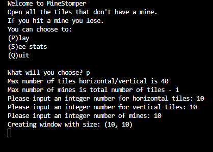
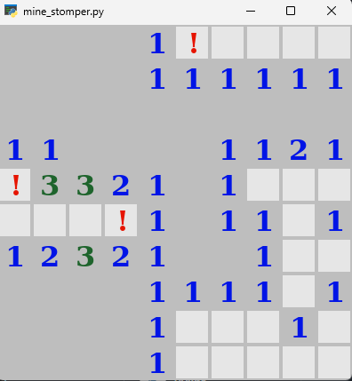

# Mine Stomper
A classic minesweeping-like game, where you have a terminal menu for starting the game, highscores and quitting.
Game playes in customable size grid and custom mine amounts.

 ## Mine Stomper - A Minesweeper Game Implementation
This module implements a complete Minesweeper game with graphics using the sweeperlib library.
It handles game state management, mine placement, tile revelation using flood fill algorithm,
game statistics tracking, and user interaction through mouse input.
Game Flow:
1. User selects to play, view stats, or quit from main menu
2. Player specifies field dimensions and number of mines
3. Game window is created with sprite-based graphics
4. First left-click places mines (avoiding clicked tile) and initializes mine counts
5. Subsequent clicks reveal tiles or flag mines
6. Game ends on mine hit (loss) or all non-mine tiles revealed (win)
7. Game statistics are saved to JSON file
Key Features:
- Dynamic field size (up to 40x40)
- Mine placement with first-click safety
- Flood fill algorithm for automatic tile revelation
- Game statistics persistence
- Mouse-based tile interaction (left-click to reveal, right-click to flag)
- Real-time game timer and turn counter
Global State:
- state: Current game board and metadata
- stats: Current game statistics
- saved_stats: Historical game records
- available: Pool of valid mine placement locations

## 
